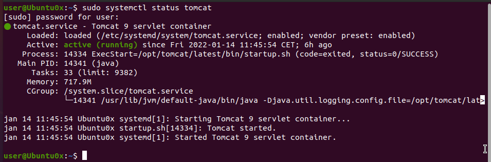

# Installing the Vigmo Dashboard
In order to get the entire project up and running, we made this summary to get you through it.

## 1. Server Configuration
First you need to set up your hosting environment in the right way. We highly recommend you use linux. In the example we are using `Ubuntu 20.04.3 LTS`

### 1.1 Installing Everything
Before starting the commands make sure your system is up to date with 
```shell
sudo apt update
```
#### 1.1.1 Tomcat
Tomcat is a webserver used for running Java Web Application Runtimes (WAR)  
So before going further, make sure java is installed. Run this command to install: 
```shell
sudo apt install default-jdk
```
Create a new tomcat user, since the server shouldn't run under the root user.

```shell
sudo useradd -r -m -U -d /opt/tomcat -s /bin/false tomcat
```
Download the latest version of tomcat from their website [Download Tomcat 9](https://tomcat.apache.org/download-90.cgi)  
With the following command you download the version that was used during development `Tomcat 9.0.56` to the temp folder.

```shell
wget http://www-eu.apache.org/dist/tomcat/tomcat-9/v9.0.56/bin/apache-tomcat-9.0.56.tar.gz -P /tmp
```

Next up is to extract the downloaded file to the `/opt/tomcat` folder: 

```shell
sudo tar xf /tmp/apache-tomcat-9*.tar.gz -C /opt/tomcat
```

In order to make upgrading in the future easy, create a symlink to the folder called `latest`:

```shell
sudo ln -s /opt/tomcat/apache-tomcat-9.0.56 /opt/tomcat/latest
```

Now we need to give the tomcat user ownership to this folder: 

```shell
sudo chown -RH tomcat: /opt/tomcat/latest
```

And then set the executable flag on all scripts within the `bin` folder. (Remember this step when you change versions)

```shell
sudo sh -c 'chmod +x /opt/tomcat/latest/bin/*.sh'
```

In order to run tomcat as a service, we need to create a `tomcat.service` file in the `/etc/systemd/system/` folder:

```shell
sudo nano /etc/systemd/system/tomcat.service
```
This should be a new file, if not, tread carefully, you might overwrite an existing configuration.  


In this new file enter the following configuration:
```ini
[Unit]
Description=Tomcat 9 servlet container
After=network.target

[Service]
Type=forking

User=tomcat
Group=tomcat

Environment="JAVA_HOME=/usr/lib/jvm/default-java"
Environment="JAVA_OPTS=-Djava.security.egd=file:///dev/urandom -Djava.awt.headless=true"

Environment="CATALINA_BASE=/opt/tomcat/latest"
Environment="CATALINA_HOME=/opt/tomcat/latest"
Environment="CATALINA_PID=/opt/tomcat/latest/temp/tomcat.pid"
Environment="CATALINA_OPTS=-Xms512M -Xmx1024M -server -XX:+UseParallelGC"

ExecStart=/opt/tomcat/latest/bin/startup.sh
ExecStop=/opt/tomcat/latest/bin/shutdown.sh

[Install]
WantedBy=multi-user.target
```

Next reload the deamon and start the service: 

```shell
sudo systemctl daemon-reload
```
```shell
sudo systemctl start tomcat
```

Now check the status, if everything went correct it should show that tomcat is now running: 

```shell
sudo systemctl status tomcat
```
Output:  


If the outputs look similar, run the following command to auto-start the tomcat service: 

```shell
sudo systemctl enable tomcat
```

Now for testing purposes you could allow access to the tomcat 8080 port for external usage. 
However in this tutorial we will be using [Nginx Reverse Proxy](https://linuxize.com/post/nginx-reverse-proxy/) to publish all three of the projects.  
To open the firewall for external access on port 8080 run the following command:  
```shell
sudo ufw allow 8080/tcp
```


Next thing we do is allow access to the tomcat management interface. This is usefull for deploying WAR files in an easy manner.  

Open the `tomcat-user.xml` file: 
```shell
sudo nano /opt/tomcat/latest/conf/tomcat-users.xml
```

#### 1.1.2 MySQL

#### 1.1.3 NodeJS

#### 1.1.4 Ngnix

### 1.2 Database Configuration
Open up the mysql command prompt and sign in to begin this configuration step: 
`sudo mysql -u root` As the root user this should sign you in directly.

#### 1.2.1 Creating the database user.

#### 1.2.2 Creating vigmo database

Run the command `CREATE DATABASE vigmo;` to create the vigmo database. (if you prefer another name, you can replace this in every following script yourself)

Now run the latest database script found in the api repo (checking compatability with the latest release is recommended)
The script can be found [here /vigmo.sql](https://github.com/NHL-S-Vigmo/Api/blob/master/vigmo.sql)

#### 1.2.3 Granting the vigmo user permissions
In step [1.2.1](#121-creating-the-database-user) we created the vigmo user on the database.

With this command you can grant him all privileges on the database created in step [1.2.2](#122-creating-vigmo-database)

```sql
GRANT ALL PRIVILEGES ON vigmo.* TO 'vigmo'@'localhost';
```

### 1.3 
